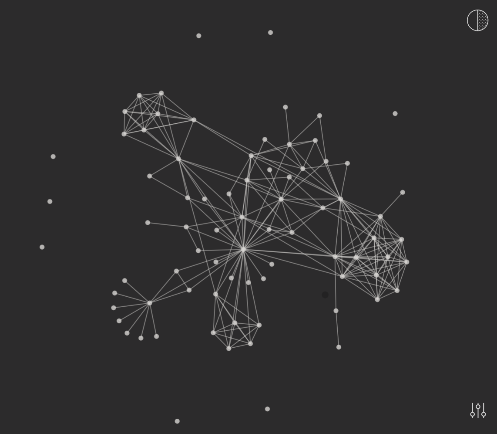

# About

[Example App Demo](https://jokorone.github.io/interactive-paper-graph)

This example app was developed to try out the possibilites of combining a canvas drawing library ([PaperJS](http://paperjs.org/reference/)) with the data-vis capabilities of [D3](https://github.com/d3/d3-force) by glueing them together using [React Hooks](https://reactjs.org/docs/hooks-overview.html).

A force directed graph is used to visualize the connections between objects in a network. By grouping the objects connected to each other in a natural way, a force directed graph is visually interesting and also makes it possible to discover subtle relationships between groups.

The algorithm is based on a physical model. It calculates the layout of the graph based solely on the information contained in the graph structure rather than relying on domain-specific knowledge.

The nodes are represented by points that repel each other like magnets. Borders connect these points by simulating a spring force to attract adjacent nodes.

This example app is a first proof of concept to create a self-documenting library, allowing developers to create an interactive network graph with custom callbacks to the canvas events.

# Goal

Provide the user with
- a Canvas component, configurable by props (colors, bounds, etc.)
- paper hook to allow custom graphics used as nodes
- d3 force simulation hook to allow manipulating the active forces displayed in the canvas
  - potencially allow different simulations
- custom interaction hooks intercepting canvas/ paper events
- sensible defaults to quickly get a interactive force graph running

# Todo

- add linking functionality
- refactor registering interaction handlers
  - emit source events to user handlers
- add support for different paper shapes
  - either predefined
  - or managed and created by user (user provides factory contructor: `(options) => paper.Item`)
- compile and bundle `src/lib`, publish to `npm`

# Development

This project was bootstrapped with [Create React App](https://github.com/facebook/create-react-app).

## Available Scripts

In the project directory, you can run:

### `npm start`

Runs the app in the development mode.\
Open [http://localhost:3000](http://localhost:3000) to view it in the browser.

The page will reload if you make edits.\
You will also see any lint errors in the console.

### `npm test`

Launches the test runner in the interactive watch mode.\
See the section about [running tests](https://facebook.github.io/create-react-app/docs/running-tests) for more information.

### `npm run build`

Builds the app for production to the `build` folder.\
It correctly bundles React in production mode and optimizes the build for the best performance.

The build is minified and the filenames include the hashes.\
Your app is ready to be deployed!

See the section about [deployment](https://facebook.github.io/create-react-app/docs/deployment) for more information.

## Learn More

You can learn more in the [Create React App documentation](https://facebook.github.io/create-react-app/docs/getting-started).

To learn React, check out the [React documentation](https://reactjs.org/).
